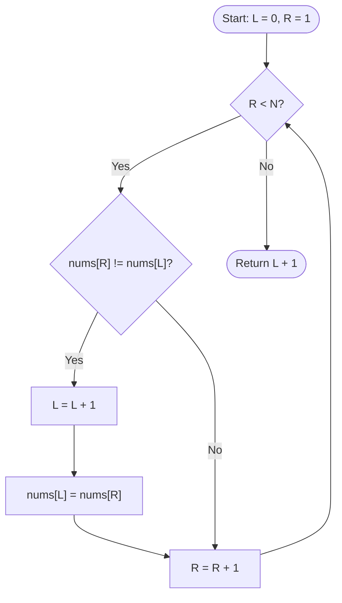

# Remove Duplicates from Sorted Array

[LeetCode Problem Link](https://leetcode.com/problems/remove-duplicates-from-sorted-array/)

Remove duplicates in-place from a sorted array such that each unique element appears only once, returning the count of unique elements.

---

## Non-Decreasing vs. Increasing
- **Non-Decreasing (Allows Duplicates)**: Elements either increase or stay equal as you move forward.
  - *Condition*: `nums[i] <= nums[i+1]`
  - *Example*: `[1, 1, 2, 2, 3]`
- **Increasing / Strictly Increasing (No Duplicates)**: Every element must be strictly greater than the preceding one.
  - *Condition*: `nums[i] < nums[i+1]`
  - *Example*: `[1, 2, 3]`

---

## Intuition
Because the input array is already sorted in **non-decreasing** order, any duplicate elements are guaranteed to be adjacent to one another. 

To transform the array to a strictly **increasing** sequence in-place without using extra memory:
1. Keep a **writer pointer** (`L`) at the position of the last-known unique element (starts at index `0`).
2. Move a **reader pointer** (`R`) forward to scan the array.
3. Every time the reader pointer (`R`) finds a value that is different from the element at the writer pointer (`L`), it means we have found a new unique element. We increment `L` to move to the next slot and write the new value there.
4. By the end of the loop, the first `L + 1` elements of the array will hold the unique elements.

### Two-Pointer Logic Flowchart

---

## Two-Pointer Approach (Optimal)
- **Logic**: 
  - Place `L` at `0`.
  - Loop `R` from `1` to `N - 1`. If `nums[R] != nums[L]`, increment `L` and copy `nums[R]` to `nums[L]`.
  - Return `L + 1` representing the total number of unique elements.
- **Time Complexity (TC)**: $\mathcal{O}(N)$ (a single pass through the array)
- **Space Complexity (SC)**: $\mathcal{O}(1)$ (in-place modifications, no extra memory)

---

## Summary Table

| Approach | Time Complexity (TC) | Space Complexity (SC) | Description |
| :--- | :--- | :--- | :--- |
| **Two-Pointer (Optimal)**| $\mathcal{O}(N)$ | $\mathcal{O}(1)$ | Shift unique elements to the front in-place using two index pointers. |
