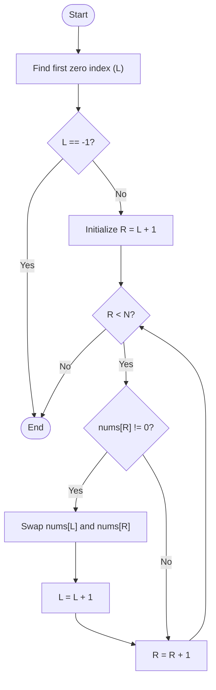

# Move Zeroes

[LeetCode Problem Link](https://leetcode.com/problems/move-zeroes/)

Move all `0`'s to the end of the array while maintaining the relative order of the non-zero elements. This must be done in-place.

---

## Intuition
To move all zeroes to the end of the array in-place, we can think of this as partitioning the array into two parts: non-zero elements at the front, and zero elements at the back. 

We can achieve this efficiently using a two-pointer technique:
1. Find the first occurrence of `0` in the array and place a pointer `L` there. If there are no zeroes, we don't need to perform any steps.
2. Use a second pointer `R` to scan the array starting from `L + 1`.
3. Every time `R` points to a non-zero element, we swap the elements at `L` and `R`. This shifts the non-zero element forward and pushes the zero backward.
4. After the swap, we increment `L` by `1` to point to the next zero.

This ensures all non-zero elements preserve their relative order, and all zeroes are pushed to the end.

### Two-Pointer Logic Flowchart

---

## Optimal Approach (Two-Pointer Scan)
- **Logic**: 
  - Find the index `L` of the first zero. If none exists, terminate early.
  - Iterate `R` from `L + 1` to `N - 1`.
  - When `nums[R]` is non-zero, swap `nums[L]` and `nums[R]`, and increment `L`.
- **Time Complexity (TC)**: $\mathcal{O}(N)$ (scans the array to find the first zero, then swaps subsequent elements in a single pass)
- **Space Complexity (SC)**: $\mathcal{O}(1)$ (in-place modifications, using constant extra space)

---

## Summary Table

| Approach | Time Complexity (TC) | Space Complexity (SC) | Description |
| :--- | :--- | :--- | :--- |
| **Two-Pointer (Optimal)**| $\mathcal{O}(N)$ | $\mathcal{O}(1)$ | Find first zero, then swap subsequent non-zero elements forward. |
